consigne: http://prodageo.insa-rouen.fr/casimono/sujetprojmd/consignes.html

# Monographie - Exploitation des journaux (logs) d’application

## Tableau de suivi des versions
| Numéro de version | Date |
|-------------------|------|
| 0.00              |   30/10/2020   |
| 0.01              |   21/11/2020   |

## Cartouche 2

 - Code du sujet : 40Z
 - Code de l'alliance : 2020A40Z
 - Liste des équipes
   - E16 - CASIment l'UML
     - Larcher, théo (aerodynamic-saucepan)
     - Billard, baptiste (BaptBillard)
     - Lebeaud, simon (LeboSi)
   - E04 - Equipe B
     - Lacroix, Daphné (dalacroix)
     - Lardière, Nina (nlardiere)
     - Delaunay, Julien (jdelaunay)
   - E07 - Equipe C
     - Benkassou, Ali (khazit)
     - Leclerc, Tanguy (LeclercTanguy)
     - Marie, Joran (iamodog)
   - E08 - Equipe D
     - De Laroque, Florent (FlorentDL)
     - Marie, Leo (lmarie01)
     - Toutain, Aurélien
## Partie A

### A0 : Introduction.

Le stockage, la collecte et l’analyse de grandes quantités de journaux (logs) sont une partie indispensable dans la gestion d’une architecture logicielle complexe. L'objectif de ce sujet est de trouver des techniques permettant d'analyser efficacement des journaux (logs) d'une application destinée à monter en charge.

Ce projet permettra d'apporter des éléments de solution à un besoin réel et actuel d'entreprises devant manipuler des bases de données volumineuses (Big Data) et marchera de paire avec une application, choisie par l'équipe, qui permettra de générer les données (les logs).
Afin d’étudier les différentes solutions permettant d’exploiter efficacement la richesse des informations contenues dans les logs l’application choisie par l’équipe sera stressée avec un outil comme Gatling.
Ce projet n'a donc pas pour but d'apporter une amélioration à un processus de traitement de données mais bien à étudier différents outils d'analyse.

L'application choisie par l'équipe est : `60B : annuaire contacts ASI`.

Les questions d’amorces suivantes permettent de mieux appréhender le sujet de ce document.

#### Quel est le rôle respectif de chacun des 3 outils ELK ?
ELK est un outil d’analyse de logs composé de 3 logiciels open source.  Elasticsearch, Logstash et Kibana. Les rôles respectifs des trois outils sont détaillés ci-dessous.
- Elasticsearch  permet l'indexation et le stockage des informations sur une base de données NoSQL.  Il propose également des requêtes avancées pour effectuer une analyse détaillée et stocke toutes les données de manière centralisée.
 - Logstash est un outil d'intégration de données open source qui permet de collecter des données à partir d'une variété de sources, de les filtrer, les transformer et de les envoyer à la destination souhaitée (ex: Elasticsearch). Son but principal est de rassembler et normaliser tous les types de données provenant de différentes sources et de les rendre disponibles pour une utilisation ultérieure.
- Kibana est un outil de visualisation de données qui complète la pile ELK , c'est une couche de visualisation qui fonctionne au-dessus d'Elasticsearch, offrant aux utilisateurs la possibilité d'analyser et de visualiser les données récupérées Elasticsearch.

#### Qu’est-ce que le mouvement DevOps ? En quoi ELK contribue au mouvement DevOps ?
DevOps est la contraction des mots “Developpers” et “Ops”. La culture DevOps vise à casser la séparation entre les développeurs qui produisent de nouvelles fonctionnalités, et les Ops qui ont pour objectif la fiabilité du site. La caractéristique la plus importante de DevOps est la création d'un cycle de production et de lancement soutenu par l'automatisation. À chaque étape, des processus scénarisés vérifient s'il y a des erreurs.

C’est dans cette optique qu’ELK contribue au mouvement DevOps, en effet en tant que solution d’analyse de logs performante elle permet de mettre en place des systèmes de monitoring et d’alerting. Le monitoring et l’alerting permettent d’avoir une vue d’ensemble sur son infrastructure, de résoudre les problèmes qui surviennent et d’améliorer les performances.

#### A quel type de question sur l’application stressée peut permettre de répondre une suite telle que ELK ?
Dans un contexte de stress d’application, ELK permet de mesurer les performances de l’application et détecter les éventuelles failles lors de scenarios particuliers, à l’aide de syst_mes de monitoring et d’alerting.

#### Quelles solutions alternatives à ELK existe-t-il sur le marché (open-source, saas ou cots) ?
Apache Solr constitue avec ELK les 2 principaux moteurs de recherche open source. Mais Elasticsearch est mieux adapté et plus fréquemment utilisé dans le cas d’utilisation d’analyse de journaux. Plusieurs solutions SaaS existent comme Algolia, Searchify ou Oracle Log Analytics.

#### A quoi sert rsyslogd ? Qu’est-ce qu’un fichier RRD ?

Rsyslogd est un démon qui collecte les messages de service provenant des applications et du noyau puis qui les répartit dans des fichiers de logs.
Un fichier RRD est  fichier servant de base de données, notamment de données raster (données cycliques, chronologiques, graphiques...).

#### Quelle est la différence entre une base de données et un moteur d’indexation ?

 La base de données permet de stocker des données et le moteur d'indexation permet d'y accéder plus rapidement.

### A1. Glossaire et Mots-clés.
- **Big Data** : Domaine technologique dédié à l’analyse de très grands volumes de données informatiques (petaoctets), issus d'une grande variété de sources, tels les moteurs de recherche et les réseaux sociaux ; ces grands volumes de données. (Source Larousse)
- **Base de données** : Ensemble structuré de fichiers regroupant des informations ayant certains caractères en commun ; logiciel permettant de constituer et de gérer ces fichiers. (Source Larousse)
- **Logs** : Fichier regroupant l'ensemble des événements survenus sur un logiciel, une application, un serveur ou tout autre système informatique. (Source dicodunet)
- **Analyse** : Étude minutieuse, précise faite pour dégager les éléments qui constituent un ensemble, pour l'expliquer, l'éclairer. (Source Larousse)
- **ELK (Elasticsearch, Logstach, Kibana)** : ELK est un outil d’analyse de logs composé de 3 logiciels open source, développés par la société Elastic : Elasticsearch, Logstach et Kibana. (Source Oracle)
- **Rsyslog** : Logiciel libre utilisé sur des systèmes d'exploitation de type Unix transférant les messages des journaux d'événements sur un réseau IP. (Source Wikipedia)
- **Fichiers RRD** : Solution de stockage des structures pyramidales pour un jeu de données raster. (Source ArcGIS)
- **Gatling** : Outil open-source de test de charge et de performance pour applications web. (Source Wikipedia)
- **Stress** : Il s'agit d'un test au cours duquel on va simuler l'activité maximale attendue tous scénarios fonctionnels confondus en heure de pointe de l'application, pour voir comment le système réagit au maximum de l'activité attendue des utilisateurs. (Source Wikipedia)
- **DevOps** : Mouvement en ingénierie informatique et une pratique technique visant à l'unification du développement logiciel (dev) et de l'administration des infrastructures informatiques (ops), notamment l'administration système. (Source Wikipedia)

### A2. Webographie

| Sites | Dates de dernière consultation |
|-------|------------------------------- |
|[Wikipédia](https://en.wikipedia.org/wiki/Big_data)| 13/11/2020|
|[Simplilearn](https://www.simplilearn.com/what-is-big-data-analytics-article)| 14/11/2020|
|[Datamation](https://www.datamation.com/big-data/big-data-analytics.html)|14/11/2020|
|[Sodifrance (Gatling)](https://blog.sodifrance.fr/procedure-de-tests-de-montee-en-charge-avec-gatling-2/)|14/11/2020|
|[ElasticSearch](https://www.elastic.co/fr/elasticsearch/)|24/11/2020|

### A3. Bibliographie

Anurag Srivastava et Douglas Miller, 24 octobre 2019, **Elasticsearch 7 Quick Start Guide: Get up and running with the distributed search and analytics capabilities of Elasticsearch**
> Sections :
> - Use cases of ElastisStack
> - Anatomy of an Analyzer
> - Aggresgating datasets

*Critère de choix* : Guide exhaustif sur Elasticsearch.

James Turnbull, 2014, **The Logstash Book**, Kindle edition

> Sections :
> - Add structured logging to your applications and parse your application logs
> - Use Logstash's awesome web interface Kibana
> - Install and deploy Logstash.

*Critère de choix* : Guide exhaustif sur Logstash.

Saurabh Chhajed, 2015, **Learning ELK Stack**, eBook

> Sections :
> - Introduction to ELK Stack
> - Building Your First Data Pipeline with ELK
> - Collect
> - Parse and transform Data with Logstash

*Critère de choix* : Présentation de ELK (Elasticsearch, Logstash, and Kibana), présentation des méthodes et de la mise en place à la configuration en passant par l’installation des outils. Parle également de pipeline de données.

### A4. Acteurs
#### Apache Solr
Apache Software Foundation est une organisation à but non lucratif créée en juin 1999 dans le Delaware aux États-Unis par	Brian Behlendorf, Roy Fielding et Ben Laurie. Elle développe ses logiciels en open-source, en mode collaboratif.

Sa plateforme logicielle de moteur de recherche Solr (prononcée "Solar"), basée sur le moteur d'indexation et de recherche de texte **Lucene**.

Le développement de Solr débute chez CNET, mais ces derniers décident très vite de rendre le code public : en janvier 2006, la première version de la plateforme est publiée, et son développement est confié à Apache. Ces derniers améliorent alors le moteur, notamment en 2008 : ils améliorent largement ses performances et le dotent d'une recherche distribuée.

Les projets **Lucene** et **Solr** sont fusionnés en 2011 : le développement est commun, les distributions sont séparées mais un tronc commun permettant de ne disposer que d'une seule version est vite créé. La recherche distribuée est nettement améliorée ; **Solr** est aujourd'hui utilisée notamment par **Adobe, Instagram, Netflix, eBay et Goldman Sachs.**

**Solr** permet l’intégration des bases de données, le surlignage des termes trouvés, l’auto-suggestion et la recherche full-text.

#### ElasticSearch
Elasticsearch inc. est une entreprise centrée sur la recherche fondée par Steven Schuurman, Uri Boness et Simon Willnauer.

L'entreprise est basée sur le succès de l'outil **Elasticsearch**, un logiciel open source, fonctionnant sur Lucene pour l'indexation et la recherche de données. Suite au succès d'**Elasticsearch** deux autres projets sont créés ; Logstash et Kibana. Logstash est un outil informatique de collecte, analyse et stockage de logs, c'est un outil d'ingestion open source. Il est généralement associé avec **Elasticsearch**, moteur de recherche distribué, et Kibana, interface d'Elasticsearch. En effet Kibana est une interface utilisateur permettant de visualiser les logs. Ces trois outils ; **Elasticsearch**, Kibana et Logstash forment la solution EKL.  L'entreprise met toute la puissance de la recherche au service de ses clients pour les aider à explorer et analyser leurs données, que ce soit le cours des actions, les flux twitter ou les logs Apache.

#### Algolia

Algolia est une start up française. Lors de sa création en 2012 par Nicolas Dessaigne et Julien Lemoine, ils ont commencé à travailler sur la recherche hors ligne pour les téléphones mobiles.

Aujourd’hui Algolia propose une plateforme de recherche en tant que serveur « search as a service » qui est comme un moteur de recherche hébergé en externe pour faire des recherches sur site avec des résultats rapides et concrets.
**Google** ou **Microsoft** proposent déjà cela, mais ils explorent et indexent le web de manière générale. Algolia propose, quant à lui, de n'indexer que les sites de leurs clients ce qui rend les recherches plus simples. Ils utilisent **RESTful JSON API** pour que les données du client soient push vers Algolia. La zone de recherche est ensuite ajoutée aux pages web du client.
Comme la recherche se fait sur un site précis et non sur le web, Algolia peut proposer des recherches intelligentes et plus spécifiques au site car ils en connaissent la structure et la sémantique.
Ils sont également très attentifs sur leur capacité à fournir des fonctionnalités instantanées, multi-plateformes et tolérantes aux fautes de frappe.
Leur solution n’est toutefois pas open-source.

Algolia fournit son service via diverses API. Il prend en charge plusieurs langages tels que Python, Ruby, PHP, JavaScript, Java, Go, C #, Scala et les systèmes d’exploitation Android et iOS. Leur solution est également intégrable sur Ruby on Rails, Symfony, Django et Laravel.

### A5. Facteurs qualité
- Consistency
- Accuracy
- Error Tolerance

### A6. Indicateurs qualité

- Consistency
  * Task effectiveness
  * Task Time
- Accuracy
  * Number of failures
  * Number of faults
- Error tolerance
  * Number of memory related errors
  * Number of inacurrate computations encountered by users
- Efficiency
  * Ressources efficiency
  * Time efficiency

### A7. Références théoriques

Nous allons dans cette partie faire le point sur les patterns appliqués au DevOps issus de http://blog.devopsguys.com/2030/02/20/twelve-devops-anti-patterns/ et https://www.slideshare.net/realgenekim/2012-velocity-london-devops-patterns-distilled ainsi que du management des logs en DevOps selon https://medium.com/logsense/devops-and-log-management-in-2019-b05d9dd08b65.

Ces patterns indiquent la marche à  suivre quand on réalise du DevOps.

#### Les 3 principes du DevOps

##### Systems thinking (Dev to Ops)

Le premier principe consiste à comprendre le flux de travail et à toujours chercher à l'augmenter. Il ne faut jamais autoriser des optimisations locales qui peuvent causer des dégradations globales et il faut parvenir à une compréhension approfondie du système.

##### Amplify feedback loops (Ops to Dev)

Ce principe consiste à comprendre et répondre aux besoins des clients internes et externes. Pour cela il faut de nombreux feedbacks qui doivent être conscits. Il faudra créer et intégrer les connaissances où elles sont nécessaires.

##### Culture of continual experimentation and learning

Le troisième principe consiste à appliquer les deux premiers en continu, afin de créer un environnement qui permet de l'apprentissage et de la compréhension en continu.

#### DevOps Areas

Nous allons maintenant voir les 4 thématiques du DevOps.

##### Area 1: Extend delivery to production

Cette thématique a pour but principal de se concentrer sur l'aspect "entreprise" avec une vue de bout en bout du projet. Cela permet d'engager la conversation entre les différents acteurs pour avancer.

Les différentes étapes sont:

- Établir la confiance entre les équipes avec des meetings.
- Comprendre le goulot d'étranglement, la limite du processus.
- L'intégration continue.
- La livraison continue.
- Intégrer les autres rôles dans le processus (management, assurance qualité ...).

##### Area 2: Extend operations feedback to project

Cette thématique a pour but de produire un feedback et de donner de la visibilité sur le travail réalisé. Cela afin de montrer les améliorations de l'organisation.

Pour cela il faut:

- Des objectifs et des instructions de fonctionnement clairs.
- Une prise de conscience commune de la situation.

##### Area 3: Embed Project knowledge into Operations

Cette thématique a pour but de raccourcir et d'amplifier les feedback, de créer de la connaissance et des capacités où il y en a besoin et s'assurer de l'optimisation du système.

##### Area 4: Embed Operations knowledge into Project

Cette thématique a pour but d'apprendre aux développeurs à réfléchir comme les opérateurs, de gérer la dette technique et d'avoir une vision de bout-en-bout du projet.

#### Lien entre DevOps et l'analyse des logs

La mise en pratique du DevOps vise à détecter rapidement les problèmes, afin que le code publié soit fiable. Le monitoring et l'analyse des logs sont importants pour obtenir une publication fiable du code. Mais l'analyse des logs est rendu de plus en plus compliqué avec la multiplication des instances et des conteneurs. On peut se retrouver avec des données brutes de plusieurs gigaoctets, ce qui rend impossible l'intervention humaine pour trouver les informations.

Pour pallier à ce problème, il faut donc rendre l'analyse des logs automatiques, hors l'automatisation est au coeur du DevOps. Il faut donc élargir l'automatisation à l'analyse des logs pour permettre un travail approfondi de détection des problèmes. Cela peut se faire au moyen de scripts automatisés qui vont identifier plusieurs types de problèmes.

Les non-fatal errors, qui ne causent pas de problèmes évidents pour l'utilisateur comme des données non valides ou des exceptions qui sont capturées et traitées. Ces problèmes peuvent dégrader les performances ou encore consommer de la mémoire. L'analyse des logs permet d'identifier la cause de ces problèmes en indiquant ce qui se passe avant le message d'erreur ou le crash du système.

Une nouvelle release pourrait affecter les performances du système. L'analyse des logs permet de savoir où le temps nécessaire à l'exécution d'une tâche ou les ressources requises ont changé. De plus le changement dans l'usage de certains patterns peut mettre à rude épreuve des aspects du code qui n'avaient pas beaucoup d'impact auparavant. Encore une fois ces problèmes pourraient être identifiés avec une analyse automatique des logs. Faire une analyse statistique de ces analyses de logs peuvent permettre d'identifier certaines tendances et donc d'accélerer la production en évitant de futurs problèmes.

## Partie B

### B1. Approche technique

La tendance actuelle quant à l'observabilité des donnée nous amène à proceder comme suit : on collecte nos indicateurs dans une base de données temporelle ou un service SaaS pour monitorer les ressources, ensuite on collecte les logs (avec la suite ELK), et enfin on utilise un troisième outil pour effectuer les traçage au niveau des requêtes.
Cependant cette approche a plusieurs inconvénients: la mise en corrélation manuelle de différentes sources de données et la redondance des données font perdre beaucoup de temps et les frais engendrés par la gestion de 3 datastores opérationnels sont élevés.

Il est donc important  de pouvoir disposer de toutes ses information  dans un magasin opérationnel unique, permettant de faire corréler ses données automatiquement via une interface utilisateur intuitive.

Nous nous basons sur le fonctionnement de la suite ELK qui permet d'exploiter toutes les données.

La suite ELK est aujourd'hui composé de 3 logiciels:
 - Elasticsearch,  
 - Kibana,
 - Logstash

Commençons par la collecte des données avec Logstash. Logstash est concidéré comme un ETL(Extract-Transform-Load), il s'agit d'un intergiciel(middleware) permettant de faire de la synchronisation massive entre plusieurs sources de données. Il est capable de gérer quasiment tous les types de logs et permet donc de filter, normaliser les informations liées au logs issus de différentes sources.
Une fois que ce pre-process de la donnée a été effectué, ces informations sont envoyées au système de stockage, Elasticsearch, qui lui a pour but l'indexation des données et les recherches sur celles-ci.
C'est enfin Kibana qui va récupérer les données issues d'Elasticsearch afin de fournir un système de visualisation graphique des données pour l'utilisateur.

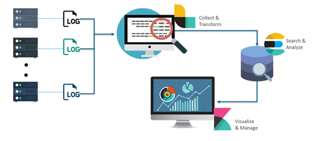

#### Logstash

Comme expliqué précédemment, Logstash est une pipeline côté serveur permettant le traitement des données. Cet outil permet de récolter, analyser, filtrer et sauvegarder des logs pour les transformer en documents formatés pouvant être utilisés ensuite par Elasticsearch. Il accepte quasiment tous les types de logs tels que les logs système, les logs de serveur web, les logs d'erreurs et les logs d'applications. L'objectif est d'obtenir un format uniformisé pour booster l'analyse.

##### Configuration flexible de pipeline

Les possibilités d'entrées différentes sont immenses (54 plugins en entrée sont listés sur la documentation). Les logs émanant de différentes sources sont traités simultanément. Voici maintenant plus de détails sur les transformations de différents formats de données.

Logstash utilise le processeur Grok pour transformer des données non-structurées en données structurées. Grok extrait des champs structurés d'un seul champ de texte dans un document: on choisit le champ dont on veut extraire les champs correspondants, ainsi que le grok pattern qui devrait correspondre. Un grok pattern est comme une expression régulière qui supporte des expressions aliasées qui peuvent être réutilisées.

Cela ne s'arrête pas là: Logstash permet également de déchiffrer des coordonnées géographiques à partir d'adresses IP ou encore d'anonymiser des données personnelles et d'exclure entièrement des champs confidentiels. Logstash compte plusieurs dizaines de plugins de filtre permettant de s'adapter au type d'entrée.

Après le traitement des données, bien que le plus utilisé soit Elasticsearch, Logstash offre un large choix de protocoles de sortie tels que csv, email, mongodb, tcp et des dizaines d'autres.

La force de Logstash repose donc dans ses possibilités d'adaptation et de personnalisation à tout type d'architecture. En effet, en plus des dizaines de plugins disponibles, il est possible de créer soi-même un plugin Logtash assez facilement grâce à leur API afin de rendre la configuration de sa pipeline encore plus flexible.

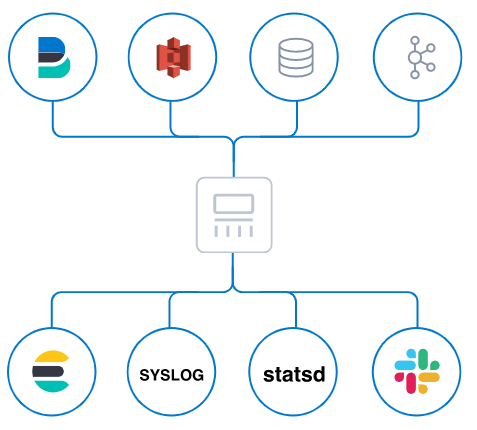

##### Facteurs qualité

Logstash utilise des files d'attente persistantes pour garantir la livraison d'évènements sans pertes. Les événements non traités sont envoyés vers une file d'attente de lettres mortes pour investigation et relecture.

Le service proposé par Logstash permet d'assurer la sécurité totale des pipelines ainsi que de pouvoir avoir un aperçu détaillé des fonctions et des flux de données.

#### ElasticSearch

ElasticSearch est un moteur de recherche basé sur la bibliotèque Apache Lucene qui est gratuite et open-source.
Elasticsearch peut être utilisé pour rechercher toutes sortes de documents. Cela permet une recherche évolutive, en temps quasi réel.
Elasticsearch est distribué, ce qui signifie que les indices peuvent être divisés en shards (partition horizontale des données dans une base de données ou un moteur de recherche) pouvant avoir zéro ou plusieurs répliques. Chaque noeud héberge une ou plusieurs shards et joue le rôle de coordinateur pour déléguer les opérations aux shards correctes. Le rééquilibrage et le routage se font automatiquement.

Les données connexes sont souvent stockées dans le même index, qui se compose d'une ou plusieurs shards primaires et de zéro ou plusieurs shards répliquées. Une fois qu'un index a été créé, le nombre de shards primaires ne peut plus être modifié.

Elasticsearch utilise Lucene et tente de rendre toutes ses fonctionnalités disponibles par le biais du JSON et de l'API Java. Il prend en charge le facettage (application de filtres) et la recherche inverse (retourne les recherches qui correspondent à un document), ce qui peut être utile pour signaler si de nouveaux documents correspondent à des requêtes enregistrées.

Une autre fonctionnalité appelée "gateway" gère la persistance à long terme des index; par exemple, un index peut être récupéré à partir de la gateway en cas de panne du serveur. Elasticsearch prend en charge les requêtes GET en temps réel, ce qui le rend adapté à un stockage de données NoSQL. Malheureusement les transactions distribuées manquent à Elasticsearch.

Elasticsearch est développé en parallèle avec un moteur de collecte et d'analyse de données appelé Logstash, une plateforme d'analyse et de visualisation appelée Kibana, et Beats, un ensemble de transporteurs de données légers. Les quatre produits sont conçus pour être utilisés comme une solution intégrée, appelée "Elastic Stack" (anciennement "ELK stack").

- **Scalabilité**

L'utilisation de JSON permet une scalabilité horizontale simplifié, ce qui permet d'adapter le hardware très facilement et ainsi traiter un nombre impressionnant de requêtes par seconde.

- **Résilience**

Elasticsearch détecte les défaillances, avec la réplication intercluster, un cluster secondaire peut passer à l'action et assurer une sauvegarde, ce qui permet de protéger les données.

#### Kibana
##### Description
Kibana est un outil de visualisation et de gestion de données (ou _data visualization dashboard_) opensource et gratuit (licence Apache 2), permettant de visualiser des données Elasticsearch et de naviguer dans la Suite Elastic. Kibana permet à l'utilisateur de générer, entre autre, des diagrammes en barre ou en ligne, des nuages de points, des camemberts ou encore des cartes pour visualiser des quantités de données volumineuses. De plus, Kibana intègre des outils de présentation tels que _Canvas_ pour permettre à l'utilisateur de créer des supports de présentation.

Kibana a pour avantage de pouvoir intégrer une visualisation en temps réel des données Elasticsearch et des interfaces utilisateur, ce qui permet d'accéder rapidement au suivi des performances applicatives (APM), aux logs et aux données des indicateurs d'infrastructure.

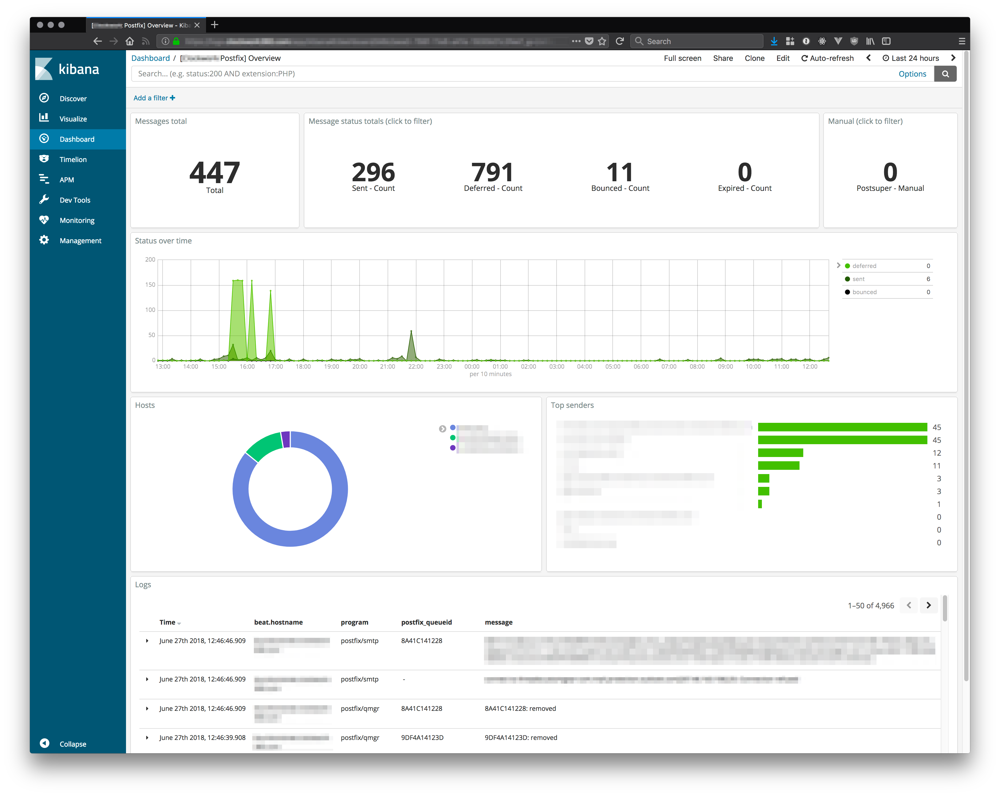

Kibana est la couche la plus haut niveau de la structure Elastic puisqu'il s'agit de l'interface entre l'utilisateur et les données. L'outil prend en entrée des données fournies par Elasticsearch sous format **JSON** et renvoie de l'information sous forme de visualiseurs variés. En termes de patterns, on peut attribuer à Kibana deux patterns principaux : _Aggregator_ et _Content filter_.

##### Utilisation
- **Pré-requis**

La suite Elastic nécessite l'installation de **Java 8 ou plus récent** que l'on peut installer via OpenJDK.

- **Définir des sources**

Lors de la première utilisation de Kibana, la première chose à définir est un **index pattern** qui indique à quel index d'Elasticsearch regarder les données. Cet index pourra par exemple correspondre à un identifiant de type de donnée, suivi d'une date. L'index pattern à définir est une phrase interprétable (type expression régulière) ce qui signifie que l'on peut déjà complexifier la sélection des logs à partir de la définition de l'index pattern.

Si besoin, il est possible d'effectuer des requêtes manuelles sur Elasticsearch, via Kibana, dans l'onglet '_Dev Tools_'.

- **Créer des visualiseurs**

La seconde étape est la création de visualiseurs. Via l'onglet '_Visualize_', il est possible de sélectionner un type de visualiseur qui demandera alors de choisir un index à charger parmi ceux créés par l'utilisateur. Vient ensuite le paramétrage du visualiseur qui nécessitera de renseigner au moins 1 métrique (axe des Y) et 1 _bucket_ (axe des X). Chacun de ces paramètres pourra, en fonction du visualiseur, offrir différents sous-paramétrages comme le type d'agrégation des données (comptage unique, pourcentages, somme cumulée etc...) ou les champs JSON à observer.

De plus, il est possible d'appliquer des filtres sur le retour des recherches du visualiseur pour encore affiner l'affichage final.

- **Aggréger sur des _dashboards_**

Cette troisième étape consiste simplement à agréger tous les visualiseurs sur une même page. Ces visualiseurs sont contenus dans des sous-fenêtres déplaçables sur le _dashboard_.

Les _dashboards_ offrent la possibilité de définir et changer la période d'observation des visualiseurs à la volée. Par exemple, on peut vouloir afficher les informations d'un _dashboard_ donné sur le dernier mois, et celles d'un autre sur la semaine.

### B2. Solutions technologiques concurrentes

#### Webalizer

Webalizer est un programme rapide et gratuit d'analyse des fichiers journaux des serveurs web. Il produit des rapports d'utilisation très détaillés et facilement configurables au format HTML, à consulter avec un navigateur web standard. Il est développé en C , ce qui lui permet d'être assez rapide et portable facilement. Il gère les journaux standard du serveur CLF (Common logfile format), plusieurs variantes du format NCSA Combined logfile, les journaux au format wu-ftpd/proftpd xferlog (FTP), le format natif du serveur proxy Squid et les formats de journaux étendus du W3C. En outre, les journaux compressés gzip (.gz) et bzip2 (.bz2) peuvent être utilisés directement sans qu'il soit nécessaire de les décompresser.

Les rapports générés peuvent être configurés à partir de la ligne de commande, ou plus communément, par l'utilisation d'un ou plusieurs fichiers de configuration.

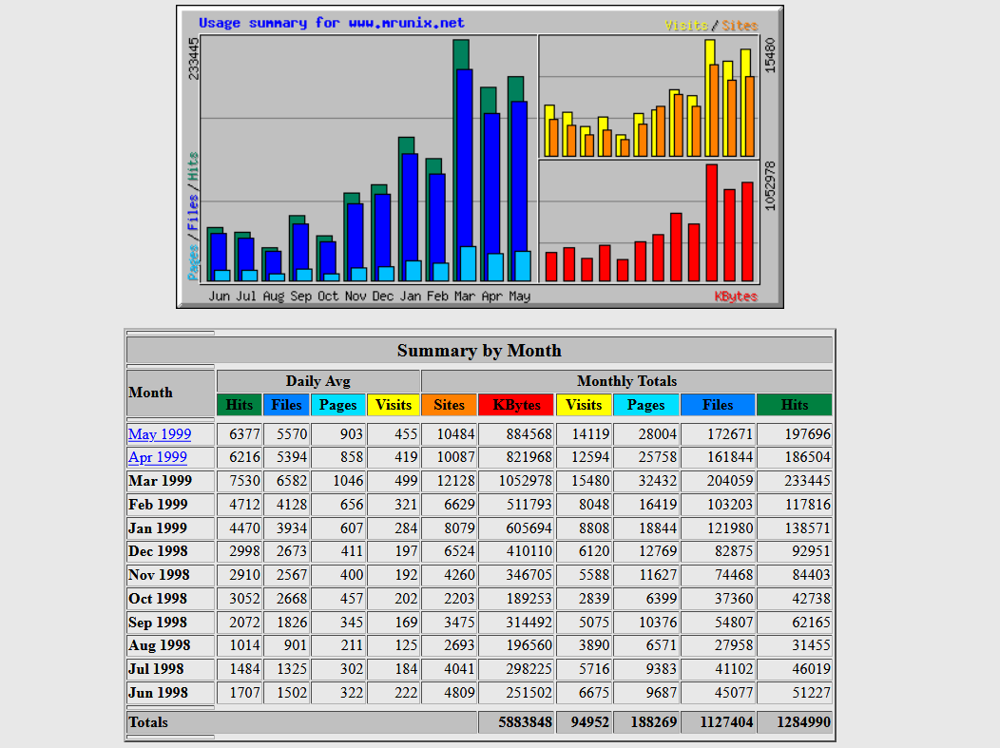

Les fichiers journaux de taille illimitée et les journaux partiels sont pris en charge, ce qui permet de faire tourner les journaux aussi souvent que nécessaire et d'éliminer la nécessité de conserver d'énormes fichiers mensuels sur le système.

Webalizer permet de visualiser les statistiques selon plusieurs titres :
- **Hits** : Un hit sur webalizer correspond au nombre total de demandes envoyées au serveur. Les demandes peuvent être des pages HTML, des images graphiques, des fichiers sonores, des séquences CGI, etc. Cela signifie qu’une visite correspond à plusieurs hits si la page visualisée contient plusieurs éléments. De plus, un hit ne regarde pas si le serveur possède le fichier ou pas ; il se peut que certains fichiers ne soient plus disponibles, dans ce cas, on aurait alors une incrémentation du compteur de Hits, mais pas du compteur de fichiers.
- **Files ou fichiers** : Les références aux fichiers correspondent au nombre total de documents, textes, images, multimédia qui ont généré une réponse positive du serveur. Il s’agit du nombre de téléchargements d’un document tel qu’une page d’accueil ou une image. Le nombre de fichiers est toujours inférieur ou égal au nombre de hits.
- **Kbytes et KOctets** : La valeur en KBytes (kilo-octets) montre la quantité de données, qui ont été envoyées par le serveur pendant la période d’enregistrement indiquée
- **Navigateurs** : Un navigateur est un logiciel client qui affiche des pages au format HTML et permet l’accès au World Wide Web (www). La visualisation d’un site est dépendante du navigateur avec lequel il est parcouru.
La rubrique « navigateurs » de Webalizer permet de connaître les navigateurs qui ont été utilisés par les visiteurs du site. Cette information va permettre de connaitre le navigateur le plus utilisé, et donc d’optimiser la visualisation de votre site pour ce type de navigateur.
- **Pages** : nombre de pages visitées par les internautes sur le site. Tout document html, ou qui génère une page html, est considéré comme une page. Par contre, les documents inclus dans un document html comme une image ou un son ne sont pas considérés comme des pages.
- **Sites ou hôte** : Chaque demande faite par un utilisateur au serveur provient d’un site ou hôte, identifiable par son nom ou son adresse IP. Les statistiques données par webalizer permettent de compter et d’identifier les utilisateurs par leur adresse IP ou le nom de leur fournisseur d’accès.
Attention : Il n’est pas possible de comptabiliser le nombre exact de personnes physiques qui ont visité le site. Par exemple, si la connexion utilisateur se fait par serveur proxy, des visiteurs distincts ne seront comptabilisés qu’une fois. Les chiffres indiqués sont cependant une bonne approximation du nombre de visiteurs.
- **URL, Entry Pages et Exit Pages** : Ces rubriques permettent de savoir comment les visiteurs utilisent le site et quelles pages ils visitent.
TOTAL ENTRY PAGES donne la référence de la page sur laquelle les utilisateurs se sont connectés et TOTAL EXIT PAGES celle sur laquelle ils ont quitté le site.
- **Visites** : Le nombre de visites s’appuie sur le nombre de demandes faites au serveur à partir d’un ordinateur. Pour éviter de compter une visite à chaque demande faite par le même ordinateur (c’est-à-dire le même utilisateur), l’heure des demandes est relevée. Si la prochaine demande émanant de ce site est envoyée dans un délai inférieur à 30 min, le nombre de visites reste le même.

Une fois ces informations récupérées, Webalizer permet de réaliser des statistiques afin d'étudier les hits et de réaliser des classements.

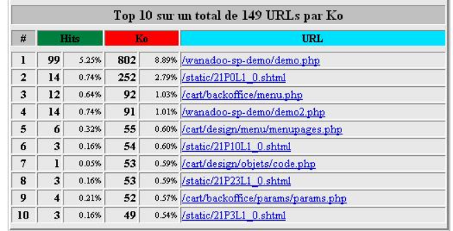

#### AWStats

AWStats est un logiciel open-source, développé par Laurent DESTAILLEUR, d’analyse de fichiers logs des serveurs Web, FTP et mails.  Il permet d’afficher les informations mensuelles, hebdomadaires, journalier ou heure par heure. Les informations peuvent concerner :
* le visiteur : provenance, dernière visite…
* la navigation : durée des visites, dernière visite, fichier vus, page d’entrée et de sortie, les pages les plus consultées
* la provenance : moteur de recherche, sites, pays…
* les configurations matérielle des visiteurs : taille d’écran, système d’exploitation, navigateur…
* les occupation du serveur
C’est un peu ce que propose Google Analytics.
Il est implémenté en Perl. Ça dernière mise à jour date de janvier 2018.
Il peut gérer des serveurs web Apache 1.3.x et 2.x, WebStar, Oracle 9iAS, WebLogic, Tomcat et les serveur FTP ProFTPd, vsFTPd.

Le logiciel est disponible sur GitHub à l’adresse suivante https://github.com/eldy/awstats.

En résumé, ce logiciel permet de générer des statistiques de son site web à partir des fichiers logs de notre serveur web, FTP ou mail. Ces résultats peuvent être consulté sur un CGI ou sur une page HTML statiques.

**Exemple d'utilisation de AWStats**

Résumé

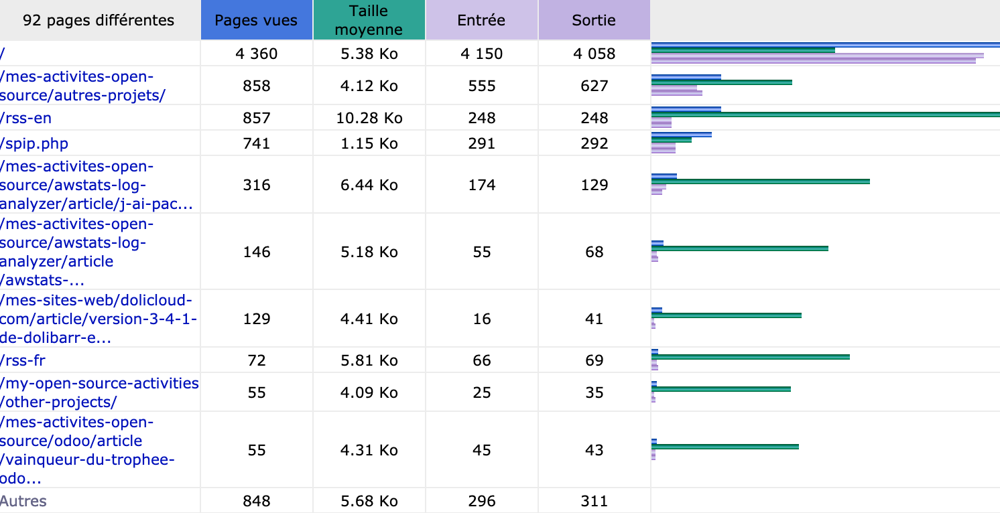

Top 10 des URL des pages

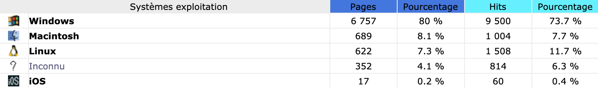

Top 10 des systèmes d'exploitaitons

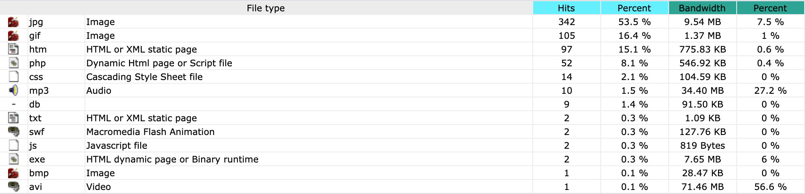

Type de fichier

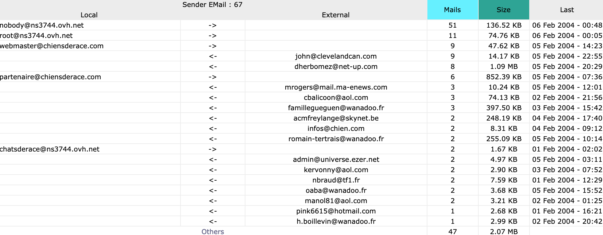

Top 20 des email envoyé

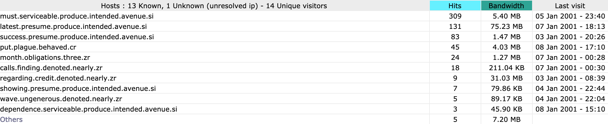

Top 10 des Hosts

#### Solr
Solr (prononcé Solar) est un sous-projet open source basé sur la bibliothèque de recherche et d’indexation Lucene d’Apache. Solr est basé sur Lucene Core et est écrit en Java. En tant que serveur de recherche, Apache Solr est l’un des outils les plus populaires pour l’intégration de moteurs de recherche verticaux. Les avantages de Solr comprennent un large éventail de fonctions (y compris, par exemple, la classification à facettes des résultats de recherche) et l’indexation accélérée. Il fonctionne également sur des conteneurs serveurs tels qu’Apaches Tomcat.
Apache Solr est intégré dans Lucene sous la forme d’un servlet. Le logicielle Lucene est une bibliothèque Java open source et gratuite utilisable indépendamment de la plateforme. Lucene est connue comme une bibliothèque NoSQL puissante et évolutive.

La configuration système requise pour Solr n’est pas très élevée. Tout ce dont il y a besoin c’est un Java SE Runtime Environment à partir de la version 1.8.0. Les développeurs ont testé le servlet sous Linux/Unix, macOS et Windows dans différentes versions. Il suffit de télécharger le paquet d’installation approprié et extraire le fichier.zip (paquet Windows) ou le fichier.tgz (paquet Unix, Linux et OSX).

**Exemple de recherche Solr**
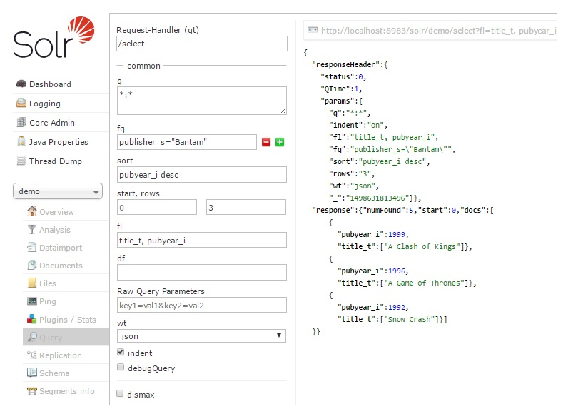

#### Loki
Site: https://grafana.com/oss/loki/

Loki est un système d'aggrégation de logs open-source, développé par Grafana Labs en 2018. Contrairement à la grande partie des systèmes semblables, Loki n'indexe pas le contenu des logs, mais plutôt une liste de labels associée à chaque flux de logs. Pour cette raison, il est facile à mettre en place et relativement léger à opérer.

Le système en entier comporte 3 briques:
  - Loki, l'aggrégateur de logs.
  - Promtail, l'agent responsable d'envoyer les logs sur Loki
  - Grafana, comme outil de visualisation. Très populaire, supporte nativement un grand nombres de sources de données différentes.

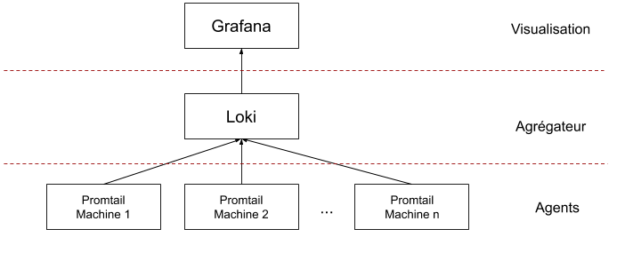

Voici une démo avec un serveur Nginx:

#### Graylog

Site : https://www.graylog.org/

Graylog est une entreprise de logiciels de gestion de logs basée à Houston, au Texas. Graylog, anciennement Torch, a été fondée en 2009 par Lennart Koopmann et a débuté comme projet open-source à Hambourg, en Allemagne.

Graylog est une solution open-source de gestion de logs. Graylog collecte, stocke et permet une recherche en temps réel et une analyse des journaux en grandes quantités (téraoctets de données) provenant de n'importe quel composant de l'infrastructure et ou application. Le logiciel utilise une architecture à trois tiers et un stockage évolutif basé sur Elasticsearch et MongoDB. Chaque message est enregistré dans une base de donnée Elasticsearch et une interface web permet de gérer et analyser les logs.

La configuration requise pour Graylog n'est pas élevée : il faut installer ElasticSearch 6.8 ou 7, MongoDB 3.6, 4.0 ou 4.2 et Java SE 8.

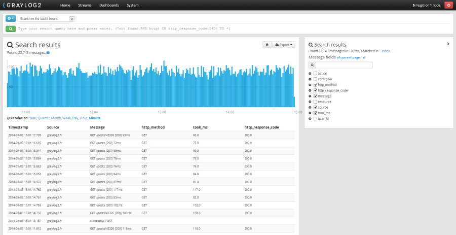
#### Splunk

Site :
https://www.splunk.com/fr_fr

Présentation :
Splunk est une multinationale américaine, basée à San Francisco, qui produit des logiciels de recherche, suivi et d'analyse de données machines (données de big data générées automatiquement par des machines) via une interface de style web2.

Splunk (le produit) collecte, indexe et met en corrélation des données en temps réel dans des archives recherchables, permettant de générer des graphiques, des rapports, des alertes, des tableaux de bord et des infographies3,4.
La mission de Splunk est de rendre les données générées par des machines compréhensibles de tous dans une même entreprise, en identifiant des tendances de données5, en donnant des outils de mesure, en diagnostiquant les éventuels problèmes et en fournissant des informations relatives à l'activité commerciale de l'entreprise. Splunk est une technologie horizontale utilisée pour l'ALM, la sécurité des données et la conformité, ainsi que pour l'analyse commerciale et web2. Début 2016, Splunk enregistre 10 000 clients à travers le monde6.

Pré-requis :
Splunk est un service cloud qui ne requiert aucune installations préalables. Ce service est déployé et géré en tant que service cloud.

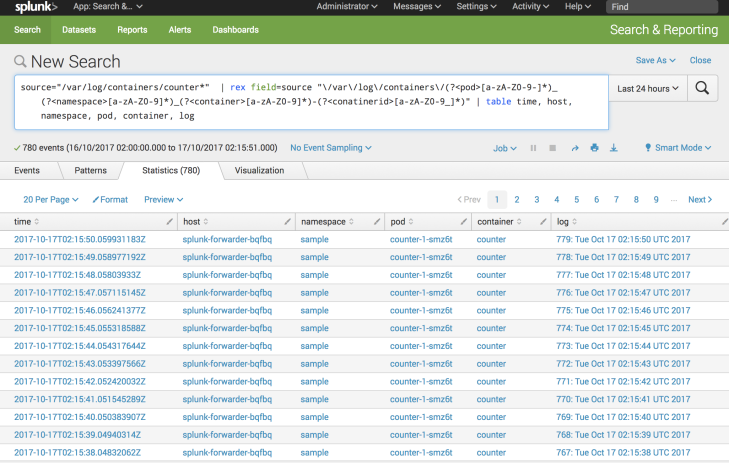

#### Loggly

olarWinds Loggly est un fournisseur de services de gestion et d'analyses des logs. Loggly permet de rassembler les logs de l'ensemble d'une infrastructure en un seul endroit pour pouvoir suivre l'activité et analyser les tendances.
Loggly permet d'analyser des logs issus de langage Java, Python, Javascript, Ruby ou encore de systèmes Linux et Android.

Le service ne nécessite pas de dépendances, il est hébergé à distance. On a juste a envoyer nos logs sous forme de fichiers JSON, rsyslog ou scripts AWS à Loggly qui se chargera de les analyser. Loggly fournit toutes sortes de scripts et de turoriels pour extraire ces fichiers depuis vos projets.

Le service supporte tout les systèmes Linux et Windows.

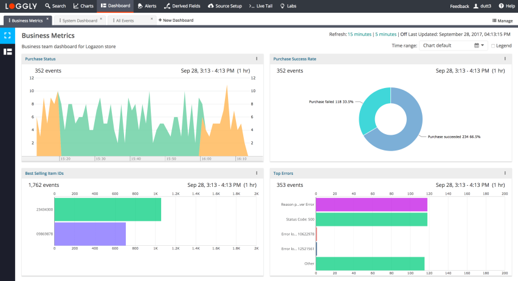

### B3. Solutions retenues

|Solution retenue|Équipe|
|------------------|------|
|||
|ELK - Kibana (natif)|E16 - Equipe B|
|Loki|E07 - Equipe C|
|Solr|E08 - Équipe D|

### B4. Liste de métriques

- Error Tolerance

  - Number of memory related errors:
    - Out of memory (RAM / Hard memory)
      * Mesurer la mémoire utilisée à l'aide de fonction bash tel que df.
      * Faisabilité: faisable.
    - Segmentation error
      * Recenser le nombre de crash de l'application liées au segmentation fault.
      * Faisabilité: faisable.

  - Number of inacurrate computations encountered by users:
    * Donner la possibilité à l'utilisateur de signaler des données imprécises. Puis, tracer cette mesure.
    * Faisabilité : difficilement faisable. Peu d'utilisateurs

- Efficiency

  - Ressources efficiency:
    * Nombre de total de lignes des logs. Mesurer le nombre de lignes obtenus par les fichiers logs. Par exemple à la fonction bash wc ( wc -l )
    * Faisabilité de la solution: faisable.

  - Time efficiency:
    * Temps d'exécution d'une requête. Calcul du temps d'exécution d'une requête à l'aide d'indicateurs.
    * Faisabilité de la solution: faisable.
- Task time :
  - Faisabilité de la procédure : faisable ;
  - Procédure de la mesure : on horodate la génération des logs issus d'un ensemble de requêtes (volume de 1000 requêtes par exemple) et l'affichage de l'analyse effectuée sur ces logs. On compare ensuite l'écart de temps entre chaque solution. La meilleur solution étant celle qui a le plus petit écart.  

- Task effectiveness :
  - Faisabilité de la procédure : mesure complexe, car il est difficile de quantifier l'efficacité de l'analyse de logs.

- Number of failures:
  - Faisabilité de la procédure : faisable ;
  - Procédure de la mesure : on demande une analyse d'un grand nombre de logs (1000 par exemple) et on compare le nombre de logs bien analysés. On compare ensuite l'écart entre chaque solution, la meilleur solution étant celle qui a le plsu petit écart.

- Number of faults:
  - Faisabilité de la procédure : faisable mais en partie inclus dans la mesure des failures

### B5. Découpage (WBS) pour réalisation des prototypes

Le WBS permet de découper le projet en tâches afin de montrer comment réaliser les prototypes.

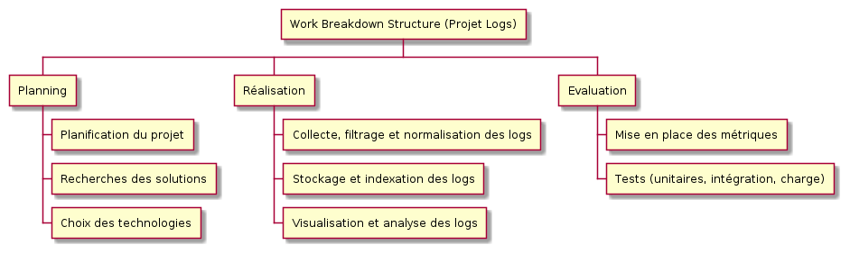

## Partie C

### C1. Architecture solution W

### C2. Architecture solution X

### C3. Architecture solution Y

### C4. Architecture solution Z
